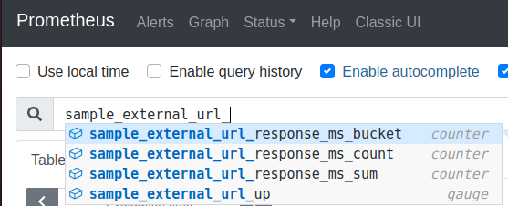

# Upstream URL Checker
This service monitors upstream URLs to ensure they are responding as expected and available. It exposes a single endpoint `/metrics` that reports metrics related to each upstream URL the service is configured to monitor. See the [metrics](#metrics) section of this document for more details regarding the exact metrics exposed by the service.

# Usage
```
Usage: ./url-checker
Arguments:
  -check-interval int
    	interval between checks, in seconds, to query the upstream URL (default 1)
  -prometheus-port int
    	Port to start prometheus server on (default 9090)
  -timeout int
    	timeout to wait for upstream URL to respond, in seconds (default 5)
  -upstream-urls string
    	comma separated list of urls to check status (Required)
```

## Example
```sh
./url-checker -upstream-urls https://httpstat.us/200,https://httpstat.us/503
```

With custom timeout and port
```
./url-checker -upstream-urls https://httpstat.us/200,https://httpstat.us/503 -timeout 2 -prometheus-port 9091
```

## Deploying
Included is a [sample kubernetes manifest](manifests/deployment.yaml) that can be used to deploy the application into a cluster. 

```
kubectl -n url-checker apply -f manifests/deployment.yaml
```

# Metrics
The following metrics are captured and exposed by the service, for each upstream url being monitored


|Metric Name | Description | Value | Labels
|------------|-------------|-------|----
|sample_external_url_up | Gauge to indicate if the upstream service is responding with a valid status | `1 == up` `0 == down` | `url`
|sample_external_url_response_ms | Histogram of response times for the upstream url in milliseconds | milliseconds | `url`





# Monitoring
To monitor the status or the upstream urls as well as the latency while checking the service, you can import the following [grafana dashboard](dashboard/url-checker-dashboard.json). 


# Development

## Building
To build the binary locally, run `make build`. 

## Build docker image
To build the application in docker for use in a containerized environment run `make build-image`.

## Testing
To run the unit tests for the application, run `make test`. The test command also captures unit test coverage information for viewing with go's coverage tools. 

## View Unit Test Coverage
To view the unit test coverage reports in a friendly UI, run `make coverage` (after `make test` has been run) which will use go's coverage tools to open a coverage report in your browser. 
